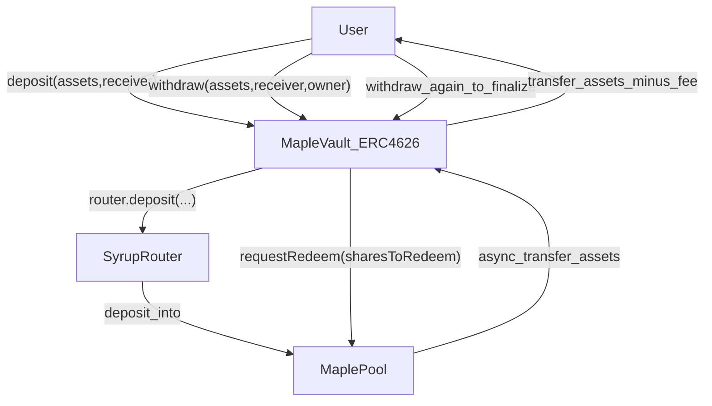

# Architecture

This repo provides **ERC-4626 vault contracts** that forward deposits into third-party protocols (e.g., Aave, Maple/Syrup) with minimal on-chain logic.

## Components

- **User (EOA)**: holds underlying assets and vault shares.
- **Vault (ERC-4626)**: mints shares on deposit; burns shares on withdraw/redeem.
- **Protocol integration**:
  - **Aave v3**: `supply` on deposit, `withdraw` on withdrawal.
  - **Maple/Syrup**: deposits via Syrup router; withdrawals via **queued redemptions** (`requestRedeem`), which are typically **asynchronous**.
- **Admin**:
  - Per-vault owner (`Ownable2Step`) controls caps and the deposit circuit breaker.

## Trust boundaries

- The vaults are thin wrappers. **Protocol risk is external**:
  - If Aave/Maple misbehave, pause, or are exploited, the vault is impacted.
- Vault admin powers are intentionally limited to **depositsDisabled** and **tvlCap** (no ability to seize user funds).

## Core flows

For contract-specific details see:

- Maple: [`docs/MapleVaultAuthorized.md`](docs/MapleVaultAuthorized.md)

